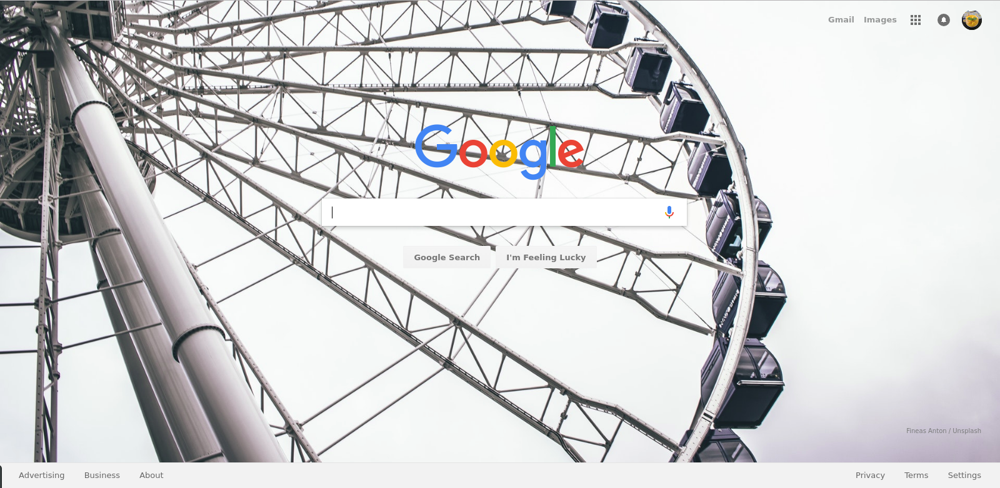

### Google Search Page Cutom Background
---
#### Introduction
This is a **Google Chrome Extension** that will replace blank default background with a random high-definition images downloaded from **Unsplash**

#### Feature
**Keyboard Shortcut**: 
  * **double-press shift key**: bring background image to the front or back

#### Sample

**After pressing shift key twice**

---

### Credit:
Images: [Unsplash](https://www.unsplash.com)

**Special Thanks to [Linda Haviv](https://medium.com/@LindaHaviv). This extension is based upon her [Google Chrome Tutorial](https://medium.com/@LindaHaviv/the-beginner-s-guide-build-a-simple-chrome-extension-in-minutes-498308ea406a)**
